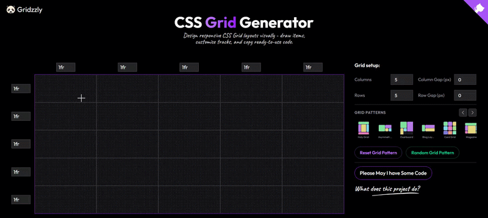

<!-- project logo -->
<p align="center">
  
</p>

<!-- desc -->
<p align="center">
  A visual CSS Grid playground built with React. Create layouts by simply clicking and dragging. No memorizing grid lines. No manual calculations. Just build your layout and copy the generated code.
</p>
<!-- badges-->
<p align="center">
  <a href="./LICENSE">
    
  </a>
  
  
  
  
  
  
  
  
  <a href="https://github.com/byllzz">
    
  </a>
  
  
</p>

<p align="center">
  <a href="https://github.com/byllzz/gridzzly/stargazers">
    
  </a>
  <a href="https://github.com/byllzz/gridzzly/forks">
    
  </a>
  <a href="https://github.com/byllzz/gridzzly/issues">
    
  </a>
  <a href="https://github.com/byllzz/gridzzly/blob/main/LICENSE">
    
  </a>
</p>

---
<!-- live demo badge -->
<p align="center">
  <a href="https://gridzzly.vercel.app">
    
  </a>
</p>


<p align="center">
  
</p>

<p align="center">
  <em>Create layouts visually, edit tracks, load presets, and export clean code instantly.</em>
</p>


---

## Features

| 1. Visual Grid Editor | 2. Instant Code Generation |
|----------------------|----------------------------|
| Draw grid areas with click‑and‑drag | Real‑time HTML & CSS generation |
| Live size overlay while drawing | Clean CSS Grid syntax |
| Supports overlapping grid items | Automatic `repeat()` optimization |
| Delete items instantly | One‑click copy |

| 3. Flexible Grid Tracks | 4. Built‑in Templates |
|------------------------|----------------------|
| Edit column/row sizes directly | Ready‑made layout presets |
| Supports `fr`, `px`, `%`, `auto`, `minmax()`, `fit-content()` | Random layout generator |
| Add/remove rows and columns dynamically | Blank canvas reset |

### Additional Highlights

- **Responsive design** – works on desktop and tablet.
- **Dark theme** – easy on the eyes.
- **Zero external dependencies** – pure React + CSS Grid.
- **Lightweight** – ~200kB gzipped.
- **Export to clipboard** – copy code with one click.

---

## Why Gridzzly?

Writing CSS Grid by hand is powerful, but remembering grid lines, adjusting spans, and experimenting with layouts can quickly become tedious.

**Gridzzly removes that friction** – design visually first, generate clean production‑ready HTML/CSS automatically.

Whether you're learning CSS Grid, prototyping a dashboard, or building a real interface, Gridzzly helps you move from idea to implementation much faster.

> **Use cases:**
> - Learning CSS Grid interactively
> - Rapid prototyping of web layouts
> - Teaching grid concepts to students
> - Generating boilerplate code for projects
> - Experimenting with complex overlapping layouts

---

##  Usage

| Action                 | How to do it                                                                                                                    |
| ---------------------- | ------------------------------------------------------------------------------------------------------------------------------- |
| Create a grid item     | Click and drag across empty cells, then release                                                                                 |
| Delete an item         | Hover over a grid item and click the **×** button                                                                               |
| Resize tracks          | Click any row/column value above the grid (e.g., `1fr`) and replace it with values like `250px`, `2fr`, or `minmax(200px, 1fr)`
| Load templates         | Select a built-in layout preset                                                                                                 |
| Generate random layout | Click  **Random Pattern**                                                                                                     |
| Export code            | Click **Generate Code**, choose HTML or CSS, then copy                                                                          |
| Reset everything       | Click **Reset Grid Pattern**                                                                                                    |
| Learn more             | Click **What does this project do?** (opens info panel)                                                                         |
---

# How It Works

### Drawing

Drag across cells to create grid areas.

``` css
grid-row: start / end;
grid-column: start / end;
```

### Overlapping

Items ignore pointer events except delete controls, allowing new items
underneath.

### Code Generation

-   Compresses repeated tracks using `repeat()`
-   Generates semantic HTML & CSS
-   Ready to paste into projects

Example:

``` css
.parent{
  display:grid;
  grid-template-columns:repeat(4,1fr);
  grid-template-rows:repeat(3,auto);
}

.item1{grid-area:1/1/3/3;}
```

## Project Structure

```
gridzzly/
├── public/
│   └── favicon.svg
├── src/
│   ├── assets/
│   │   └── strokeLight.png
│   ├── components/
│   │   ├── CSSGridGenerator.jsx
│   │   ├── VisualGrid.jsx
│   │   ├── PlacedItemsOverlay.jsx
│   │   ├── GridSetupPanel.jsx
│   │   ├── TemplatePresets.jsx
│   │   ├── TrackSizeInputs.jsx
│   │   ├── CodeExportModal.jsx
│   │   └── ProjectInfoPanel.jsx
│   ├── data/
│   │   └── templates.js
│   ├── hooks/
│   │   └── useGridGenerator.js
│   ├── App.jsx
│   ├── main.jsx
│   └── index.css
├── .gitignore
├── index.html
├── package.json
├── README.md
├── LICENSE
└── vite.config.js
```

##  Contributing

Contributions are welcome. Yes, even yours.

##  How to contribute

* Fork the repository
* Create a feature branch

  ```bash
  git checkout -b feature/amazing-feature
  ```
* Commit your changes

  ```bash
  git commit -m "Add amazing feature"
  ```
* Push to your branch

  ```bash
  git push origin feature/amazing-feature
  ```
* Open a Pull Request

---
### Guidelines

To keep things from turning into chaos disguised as code:

* Use **ES6+ syntax**
* Format code using **Prettier** (config is already provided)
* Write **clear, descriptive commit messages** (future-you will suffer otherwise)
* Update documentation when needed (yes, even that forgotten README section)
* Ensure there are **no console errors or warnings** before submitting

---

##  Getting Started

### Prerequisites

- **Node.js** 18+ (LTS recommended)
- **npm**, **yarn**, or **pnpm**

### Installation

```bash
# Clone the repository
git clone https://github.com/byllzz/gridzzly.git

# Navigate to the project
cd gridzzly

# Install dependencies
npm install
```

##  FAQ

**Can I use Gridzzly for commercial projects?**
Yes. It’s MIT licensed, which basically means you can use it, modify it, ship it, and even sell it. No permission ritual required.

**Does it work on mobile?**
The UI is built primarily for desktop (mouse + keyboard). Tablets get partial support through basic touch interactions. Full mobile optimization is planned, because reality insists on phones existing.

**How do I report a security vulnerability?**
Email: [bilalmlkdev@example.com](mailto:bilalmlkdev@example.com)
Or open an issue with a **security** label. Please don’t turn it into a public spectacle.

**Can I contribute without coding?**
Yes. Code is not the only currency here. You can help by:

* Improving documentation
* Reporting bugs
* Suggesting features
* Creating tutorials or videos
* Translating the UI

---

##  Support

If **Gridzzly** saves you time or helps you learn, consider supporting the project:

* ⭐ **Star** this repository on GitHub
* 🐦 **Share** it with your friends or on social media
* 💬 **Leave feedback** or suggest ideas in GitHub Discussions
* ☕ **Buy me a coffee** if you'd like to support future development

<p align="left">
  <a href="https://buymeacoffee.com/byllzz">
    
  </a>

  <a href="https://github.com/sponsors/byllzz">
    
  </a>
</p>

---

<p align="center"> Made with 💜 using React, CSS Grid, and a slightly unhealthy amount of enthusiasm for layout systems. <br /> <strong>Happy Gridding! 🎉</strong> </p><p align="center"> © 2026 Gridzzly - Open Source MIT</p>
